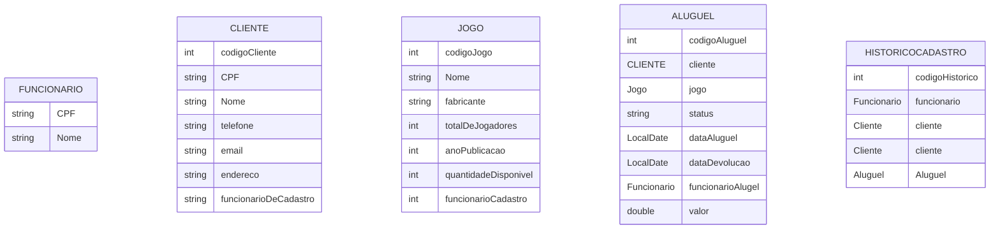

# Abstracao com java

## Descrição
Este projeto serve para treinar a capacidade de abstracao utilizando a linguagem de programacao Java, para esse projeto sera tratado um conteudo da materia de banco de dados da universidade UNICESUMAR.

&nbsp;

Esse projeto serve para treinar os principais pilares da programacao orientada a objetos, sendo eles:

### Abstracao
### Heramca
### Polimorfismo
### Encapsulamento

## Descricao do problema

&nbsp;
Um cliente novo, dono de uma locadora de jogos de tabuleiro, quer um sistema para gerenciar o aluguel de jogos da loja.

O cliente explicou como funcionam os pocessos de aluguel, cadastro de clientes e cadastro de jogos. Baseado nos requisitos apresentados pelo cliente, você fez as seguintes anotações, já confirmadas pelo cliente:

Os clientes alugam um ou mais jogos por uma semana e pagam 10 Reais por jogo. No atendimento, o funcionário verifica se o cliente tem algum empréstimo atrasado. Se não tiver, o funcionário registra o código de cada jogo, a data do aluguel e o número do cliente em uma planilha. O cliente paga e leva os jogos. Cada jogo é registrado como um aluguel único na planilha.

Os atendentes também fazem o cadastro de novos jogos e novos clientes com frequência. Para cadastrar o Jogo, um atendente informa o código do jogo, o nome do jogo, o nome do fabricante, o número máximo de jogadores permitidos no jogo e o ano de publicação e o número de cópias do jogo.

Para cadastrar clientes, o atendente registra o CPF, nome completo, telefone, endereço e Email.

**É fundamental registrar qual atendente foi responsável pelo cadastro de cada cliente**, **de cada jogo e de cada aluguel.** **Para controle do sistema, o atendente será identificado pelo seu CPF e o banco também deve registar o nome completo do atendente.**

## Entidades mapeadas

**Loja**, **Funcionario**, **Jogo**, **Cliente** e **Aluguel**
## Atributos por entidade



### Metodos

- **Cadastro de Clientes**: O funcionario pode cadastrar um novo cliente
- **Cadastro de Funcionários**: A loja pode cadastrar um novo funcionario
- **Cadastro de Jogos**: O funcionario pode cadastrar um novo jogo
- **Verifica cliente em atraso**: O funcionario verifica se o cliente tem emprestimo em atraso
- **Empréstimo de Jogos**: O funcionario realiza o emprestimo
- **Devolucao de Jogos**: O funcionario recebe os jogos novamente
- **Histórico de Empréstimos**: Visualização do histórico de jogos emprestados.
- **Historico de Cadastros**: Visualizacao do historico de cadastros de clientes e jogos

## Tecnologias Utilizadas

- **Java**: Console para interacao com usuario

## Requisitos

- **Java 8++**: Java 8 ou superior para perfeito funcionamento dos codigos
- **IDE**: IDE de sua preferencia( IDE utilizada: IntelliJ ).

## Instalação

1. Clone este repositório:
   ```bash
   git clone https://github.com/igomarcelino/abstracao-com-java.git

